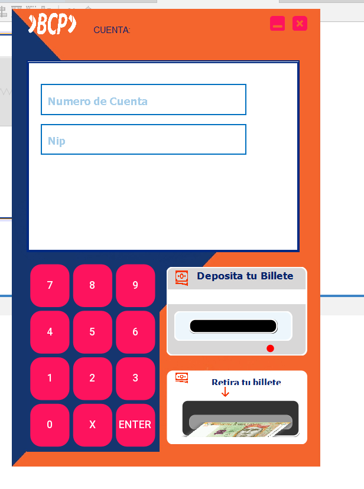
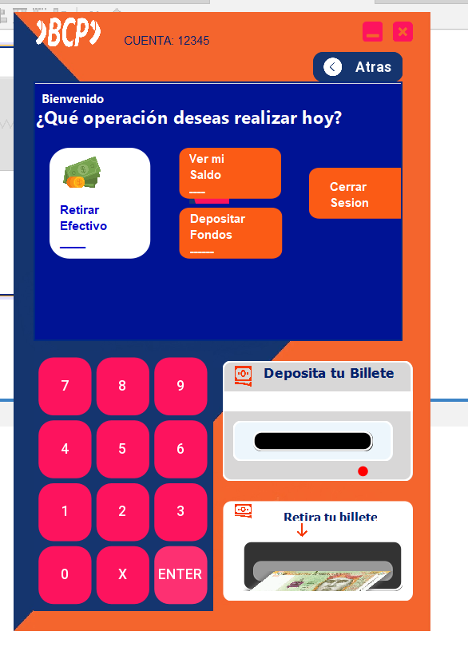
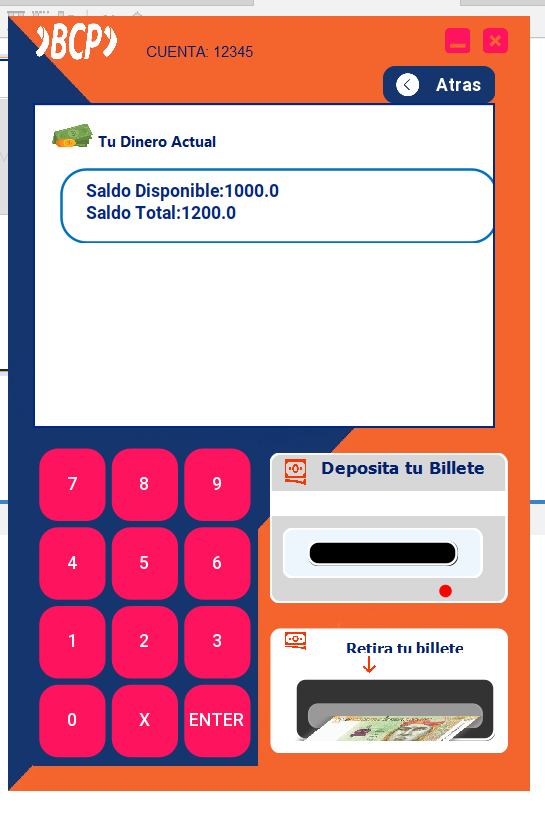
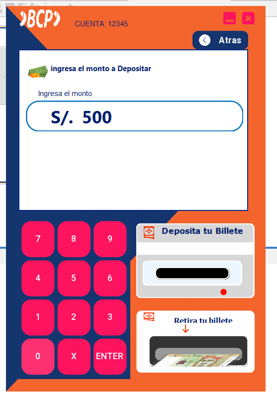
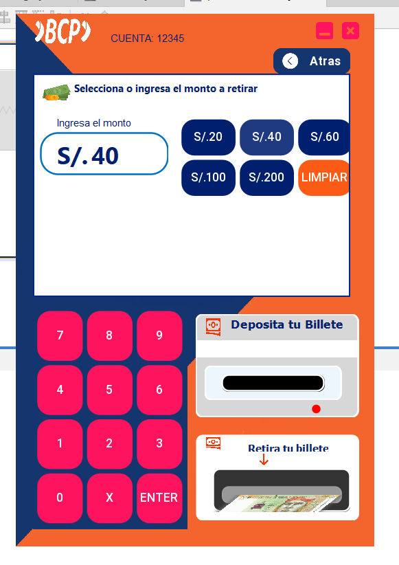

# ATM - Sistema de Cajero Automático

Este proyecto es una **práctica académica de la universidad** que simula un sistema de **Cajero Automático (ATM)**. Está desarrollado en **Java con NetBeans** y tiene como objetivo mostrar el funcionamiento básico de un cajero automático, permitiendo realizar operaciones como consultas de saldo, retiro de dinero y cambio de clave.

## 🖼️ Capturas

A continuación, se muestran algunas capturas del sistema en acción:

## 🚀 Requisitos

- **JDK (Java Development Kit)** 8 o superior.
- **NetBeans IDE** para ejecutar el proyecto.

## 🛠️ Características

- **Operaciones básicas** de un cajero automático: consultar saldo, retirar dinero y cambiar clave.
- **Interfaz gráfica de usuario** simple y funcional.
- **Simulación** de un sistema de cajero automático sin conexión a bases de datos reales.

## 📢 Notas

Este proyecto es una **práctica académica** que simula el funcionamiento de un cajero automático. No está conectado a un sistema bancario real y solo sirve para fines educativos.

## 📞 Contacto

Si tienes alguna pregunta o necesitas ayuda, no dudes en contactarme al **+51940500006**.

**Desarrollado por:**
Raúl Hacho Cutipa
